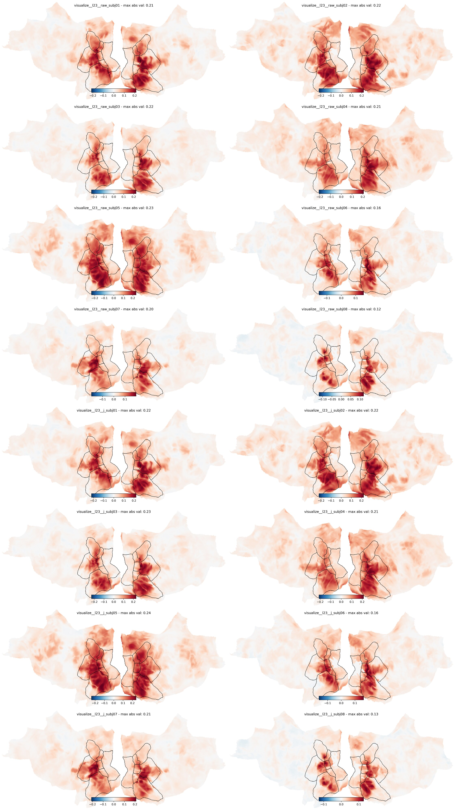
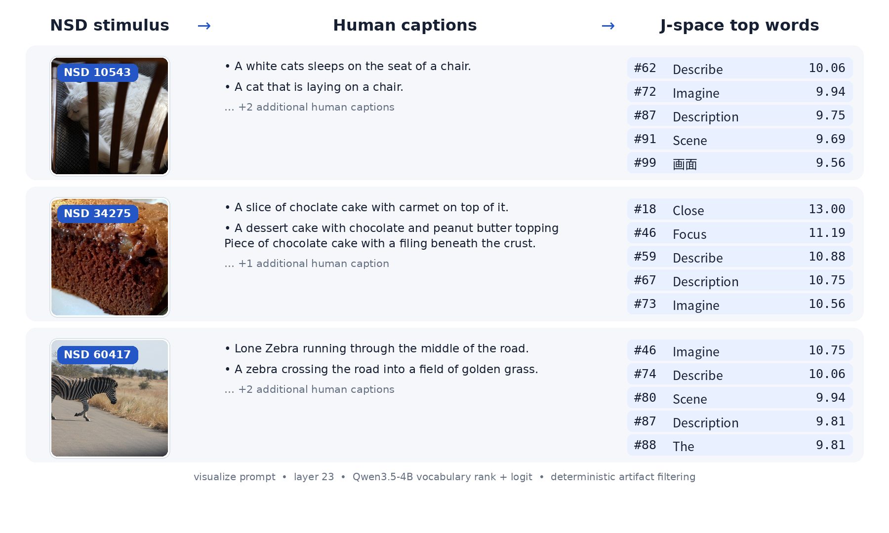

# Jacobian Lens × NSD

## Abstract

This project tests whether Jacobian-transported residual representations from
Qwen3.5-4B align with human brain responses to natural scenes differently from
matched raw residual representations. Caption-derived text—not images—is passed
through the language model, and representational similarity analysis (RSA)
compares the resulting features with Natural Scenes Dataset (NSD) fMRI
responses. The comparison holds model, prompt, layer, token position, stimuli,
and brain-analysis pipeline fixed. The accompanying layer-23 maps are
descriptive: raw and J-space topographies appear broadly similar, with modest
local differences, but the figure alone does not establish superior alignment.

## Research question

**Do Jacobian-transported (J-space) representations exhibit a different
spatial distribution or magnitude of brain alignment than raw LLM residual
representations?** Here, *different* denotes a change relative to the matched
raw control; it does not imply that J-space is *better*. A claim of better
alignment requires a defined comparison metric and subject-level inference,
not visual inspection alone.



*Figure 1. J-space versus raw LLM brain alignment at Qwen3.5-4B layer 23 under
the `visualize` prompt condition. Each row is one subject (1–8): the left column
shows the Jacobian-transported residual and the right column shows its matched
raw residual. Each cortical map is the subject-level mean over eight matched
100-stimulus samples, projected to `fsaverage`, with stream-ROI contours
overlaid. Color encodes searchlight RSA correlation (Pearson r between the brain
and model correlation-distance RDMs). Panels use independent symmetric color
limits, reported by the maximum absolute value in each title. These maps are
descriptive and do not by themselves test whether either representation is
better.*

## Methodology

- **Model and features.** The primary model is
  [`Qwen/Qwen3.5-4B`](https://huggingface.co/Qwen/Qwen3.5-4B). Layers 8, 16, 23,
  and 30 contribute the raw residual \(h_l\) and its transported representation
  \(J_l h_l\); the final decoder-block residual is an additional control. The
  fixed pretrained `qwen-n1000` lens contains layer-to-final average Jacobians
  estimated from 1,000 WikiText examples, following the
  [Jacobian Lens](https://transformer-circuits.pub/2026/workspace/index.html)
  formulation (Gurnee et al., 2026).
- **Text inputs.** Each NSD stimulus is represented by its COCO captions. The
  `plain` pipeline supplies the reconstructed captions directly; `visualize`
  asks Qwen to integrate those captions into a coherent scene. Both pipelines
  are deterministic, use no image pixels, chat template, text generation, or
  truncation, and read out the final non-padding prompt token.
- **Representational comparison.** For every subject and feature, pairwise
  correlation-distance RDMs are computed without feature normalization.
  Matched NSD searchlights compare these model RDMs with local fMRI-pattern
  RDMs using Pearson correlation. Analyses use subjects 1–8, sessions 1–10,
  three-repeat conditions, and the same eight disjoint 100-stimulus samples per
  subject. MPNet is retained as a semantic reference; the primary comparison is
  always \(J_l h_l\) versus \(h_l\) from the same Qwen layer, prompt, readout,
  stimuli, and searchlight pipeline.

The overall LLM–NSD alignment paradigm follows
[Doerig et al. (2025)](https://doi.org/10.1038/s42256-025-01072-0), and the RDM
comparison follows the original RSA framework of
[Kriegeskorte, Mur, and Bandettini (2008)](https://doi.org/10.3389/neuro.06.004.2008).
The repeated-image dataset and caption provenance are described by
[Allen et al. (2022)](https://doi.org/10.1038/s41593-021-00962-x) and
[Lin et al. (2014)](https://doi.org/10.1007/978-3-319-10602-1_48), respectively.
See [DESIGN.md](docs/DESIGN.md) for the full protocol and interpretation
guardrails.

## Layer performance summary

| Prompt | Layer | Raw mean | J / control mean | J−raw | Raw peak† | J / control peak† | BH q |
|---|---:|---:|---:|---:|---:|---:|---:|
| Visualize | 8 | 0.008331 | 0.007353 | −0.000977 | 0.061874 | 0.056413 | 0.20625 |
| Visualize | 16 | 0.004153 | 0.003904 | −0.000250 | 0.033036 | 0.029829 | 0.49219 |
| Visualize | 23 | 0.022280 | 0.023541 | +0.001261 | 0.198909 | 0.205118 | **0.01875** |
| Visualize | 30 | 0.021411 | 0.023056 | +0.001645 | 0.178131 | 0.194584 | **0.01875** |
| Visualize | Final control | — | 0.022931 | — | — | 0.192661 | — |
| Caption-only (`plain`) | 8 | 0.003301 | 0.002679 | −0.000622 | 0.032830 | 0.030033 | 0.20625 |
| Caption-only (`plain`) | 16 | 0.002862 | 0.003254 | +0.000393 | 0.029869 | 0.033456 | 0.20625 |
| Caption-only (`plain`) | 23 | 0.003621 | 0.004128 | +0.000506 | 0.038274 | 0.042349 | 0.19922 |
| Caption-only (`plain`) | 30 | 0.005362 | 0.005689 | +0.000326 | 0.052007 | 0.056541 | 0.23214 |
| Caption-only (`plain`) | Final control | — | 0.005865 | — | — | 0.058739 | — |

`Mean` is the group mean of subject whole-searchlight summaries; `peak` is the
mean across subjects of each subject's maximum after its eight native sample
maps are averaged centrewise over authoritative valid searchlight centres.
**† Descriptive peaks only: these are peak SEARCHLIGHT-CENTRE RSA correlations,
not single-voxel correlations; they are noise-sensitive and have no attached
p/q inference.** BH q applies only to the paired J−raw whole-searchlight means.

[Full CSV with 95% subject t CIs and observed peak ranges](docs/layer_performance_summary.csv)
· [Performance figure](docs/assets/layer_performance_summary.png)
· [Methods and interpretation](docs/LAYER_PERFORMANCE_SUMMARY.md)



*Figure 2. Illustrative Qwen3.5-4B vocabulary readouts from
`unembed(J_23 h_23)` under the `visualize` prompt for subject-1 conditions
10,543, 34,275, and 60,417. Each row uses the same NSD condition for the image,
captions, and stored transported vector. The five displayed tokens retain their
raw vocabulary ranks (`#`) and logits after a deterministic formatting-only and
duplicate-token filter; no semantic terms were selected or removed. The brain
RSA itself uses the full 2,560-dimensional transported vectors before
unembedding. Stimulus sources (NSD crop / COCO ID) are
10,543 / 23,163: [“Chair as Frame” by zeevveez](https://www.flickr.com/photos/zeevveez/7990954613/),
34,275 / 104,825: [“Coca-Cola cake” by TheSeafarer](https://www.flickr.com/photos/sheilascarborough/9270434659/),
and 60,417 / 207,117: [“zebra crossing!” by krugergirl26](https://www.flickr.com/photos/71888644@N00/6114561350/);
all three are licensed [CC BY 2.0](https://creativecommons.org/licenses/by/2.0/).
NSD and COCO provenance is described by Allen et al. (2022) and Lin et al.
(2014), cited above.*

The audited generation and validation procedure is in
[`scripts/make_jspace_readout_figure.py`](scripts/make_jspace_readout_figure.py).

## Installation

Lightweight development and model-free tests do not install model weights,
Torch, TensorFlow, or NSD tooling:

```bash
python -m venv .venv
. .venv/bin/activate
python -m pip install -e '.[dev]'
jlens-nsd --help
jlens-nsd smoke
```

Install model extraction support separately:

```bash
python -m pip install -e '.[model]'
```

The `nsd-upstream` extra pins NSD source commit
`a60e0eafb8d02841159e344adb732062734bc302`. Its
[historical KietzmannLab repository](https://github.com/KietzmannLab/nsd_visuo_semantics)
is unavailable; the same public history is currently hosted at
[`adriendoerig/visuo_llm`](https://github.com/adriendoerig/visuo_llm). Because
the upstream metadata pins TensorFlow 2.15 and a large legacy dependency set,
use the extra on a compatible Python 3.10/3.11 environment:

```bash
python -m pip install -e '.[nsd-upstream]'
```

In a modern pre-provisioned scientific environment, including Python 3.12,
install the source without its dependency set and add this project's runtime
extra:

```bash
python -m pip install --no-deps \
  'nsd-visuo-semantics @ git+https://github.com/adriendoerig/visuo_llm.git@a60e0eafb8d02841159e344adb732062734bc302'
python -m pip install -e '.[nsd-runtime]'
```

The `model` extra pins Anthropic's `jacobian-lens` source. A local checkout can
instead be selected with `--jlens-checkout` or
`JLENS_NSD_JLENS_CHECKOUT`.

## Configuration and running

External paths are supplied by global CLI flags or matching environment
variables; no workstation path is built into the package.

| CLI flag | Environment variable | Purpose |
|---|---|---|
| `--results-dir` | `JLENS_NSD_RESULTS` | New or resumed artifacts; default `./results` |
| `--nsd-dir` | `JLENS_NSD_NSD_DIR` | NSD root |
| `--captions` | `JLENS_NSD_CAPTIONS` | 73,000-row tokenized caption pickle |
| `--mpnet-base` | `JLENS_NSD_MPNET_BASE` | Existing 10-session MPNet result tree |
| `--jlens-checkout` | `JLENS_NSD_JLENS_CHECKOUT` | Optional Jacobian Lens source checkout |

Local model and lens directories can be set with
`JLENS_NSD_QWEN4B_MODEL`, `JLENS_NSD_QWEN1_7B_MODEL`, and
`JLENS_NSD_LENS_ROOT`. The extraction stages also accept `--model-path` and
`--lens-root`; the orchestrator accepts `--qwen4b-model`,
`--qwen1-7b-model`, and `--lens-root`.

Global flags precede an individual stage:

```bash
jlens-nsd \
  --results-dir /path/to/jlens-results \
  --nsd-dir /path/to/NSD \
  --captions /path/to/nsd_allWords_per_image.pkl \
  --mpnet-base /path/to/mpnet_10_sessions \
  prepare

jlens-nsd --results-dir /path/to/jlens-results smoke --with-data
```

The resumable end-to-end run uses the canonical 4B profile and a matched 1.7B
fallback:

```bash
jlens-nsd-orchestrate \
  --results-dir /path/to/jlens-results \
  --nsd-dir /path/to/NSD \
  --captions /path/to/nsd_allWords_per_image.pkl \
  --mpnet-base /path/to/mpnet_10_sessions \
  --profile qwen4b --fallback-profile qwen1.7b \
  --subjects 1,2,3,4,5,6,7,8
```

For subset validation, `--subjects 1` scopes condition preparation, RDMs,
searchlight, projection, plots, and the descriptive report to subject 1. The
available stages are `prepare`, `prefetch`, `preflight`, `extract`, `rdms`,
`searchlight`, `project`, `plot`, and `summarize`. See the
[runbook](docs/RUNBOOK.md) for stage-specific commands and resume behavior and
the [upstream compatibility note](docs/UPSTREAM_COMPATIBILITY.md) for the
precise dependency boundary.

Generated results, external datasets, and model weights remain outside Git and
are excluded by `.gitignore`; only compact documentation assets such as Figure
1 belong in the repository. Model-free unit, lint, package, CLI, and synthetic
smoke checks run without external data. Real extraction and searchlight checks
require the configured weights, GPU, NSD data, searchlight geometry, and
`pycortex`/`fsaverage` assets.

See [ATTRIBUTION.md](ATTRIBUTION.md) and [LICENSE](LICENSE).
