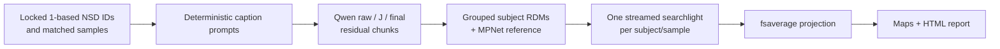

# Jacobian Lens × NSD

Standalone, resumable representational-similarity analysis of ordinary and
Jacobian-transported Qwen residuals against Natural Scenes Dataset (NSD) brain
responses.



## Scientific contract

- Subjects 1–8, sessions 1–10, sorted three-repeat conditions only.
- Existing eight disjoint 100-image samples per subject are reused exactly.
- Two fixed prompts (`visualize`, `plain`) are tokenized without a chat template,
  generation, or truncation. Features use the final non-padding prompt token.
- Runtime-selected fitted layers nearest 25%, 50%, 75%, and the penultimate
  decoder block; each yields raw `h_l` and transported `J_l h_l`, plus one final
  block residual per prompt.
- Subject RDMs use SciPy correlation distance without feature normalization.
  All features and the MPNet reference are lexically grouped so each brain RDM
  is computed once.

The overall methodological paradigm follows Doerig et al.'s alignment of
language-model representations with NSD brain responses
([Doerig et al., 2025](https://doi.org/10.1038/s42256-025-01072-0)). These
choices also follow representational similarity analysis
([Kriegeskorte et al., 2008](https://doi.org/10.3389/neuro.06.004.2008)), the
NSD repeated-image design ([Allen et al., 2022](https://doi.org/10.1038/s41593-021-00962-x)),
COCO caption collection ([Lin et al., 2014](https://doi.org/10.1007/978-3-319-10602-1_48)),
and the Jacobian Lens residual-transport definition
([Gurnee et al., 2026](https://transformer-circuits.pub/2026/workspace/index.html)).
See [the full design](docs/DESIGN.md).

## Install

Lightweight development and model-free tests do not install Torch, TensorFlow,
NSD tooling, or weights:

```bash
python -m venv .venv
. .venv/bin/activate
python -m pip install -e '.[dev]'
jlens-nsd --help
jlens-nsd smoke
```

Model extraction:

```bash
python -m pip install -e '.[model]'
```

The NSD source dependency is declared in the `nsd-upstream` extra and pinned to
`a60e0eafb8d02841159e344adb732062734bc302`. The historical KietzmannLab URL
currently points to an unavailable repository; the same public history is now
at `adriendoerig/visuo_llm`. Its package metadata pins TensorFlow 2.15 and a
large, legacy dependency set. On a compatible Python 3.10/3.11 environment:

```bash
python -m pip install -e '.[nsd-upstream]'
```

For a modern pre-provisioned scientific environment (including Python 3.12),
install only its source package and use this project's direct runtime extra:

```bash
python -m pip install --no-deps \
  'nsd-visuo-semantics @ git+https://github.com/adriendoerig/visuo_llm.git@a60e0eafb8d02841159e344adb732062734bc302'
python -m pip install -e '.[nsd-runtime]'
```

The optional model extra pins Anthropic's `jacobian-lens` source. An explicit
local checkout can be used instead with `--jlens-checkout` or
`JLENS_NSD_JLENS_CHECKOUT`.

## Configure external data

No package default contains a workstation path. Global CLI flags have matching
environment variables:

| CLI flag | Environment variable | Meaning |
|---|---|---|
| `--results-dir` | `JLENS_NSD_RESULTS` | All new/resumed run artifacts; default `./results` |
| `--nsd-dir` | `JLENS_NSD_NSD_DIR` | NSD root |
| `--captions` | `JLENS_NSD_CAPTIONS` | 73,000-row tokenized caption pickle |
| `--mpnet-base` | `JLENS_NSD_MPNET_BASE` | Existing 10-session MPNet result tree |
| `--jlens-checkout` | `JLENS_NSD_JLENS_CHECKOUT` | Optional Jacobian Lens source checkout |

Model-specific local directories use `JLENS_NSD_QWEN4B_MODEL`,
`JLENS_NSD_QWEN1_7B_MODEL`, and `JLENS_NSD_LENS_ROOT`, or the extraction flags
`--model-path` and `--lens-root`.

Example (global flags precede the stage):

```bash
jlens-nsd \
  --results-dir /path/to/jlens-results \
  --nsd-dir /path/to/NSD \
  --captions /path/to/nsd_allWords_per_image.pkl \
  --mpnet-base /path/to/mpnet_10_sessions \
  prepare

jlens-nsd --results-dir /path/to/jlens-results smoke --with-data
```

## Run

The durable orchestration executes extraction and TensorFlow searchlights in
separate processes and resumes validated chunks/sample maps:

```bash
jlens-nsd-orchestrate \
  --results-dir /path/to/jlens-results \
  --nsd-dir /path/to/NSD \
  --captions /path/to/nsd_allWords_per_image.pkl \
  --mpnet-base /path/to/mpnet_10_sessions \
  --profile qwen4b --fallback-profile qwen1.7b
```

Individual stages are `prepare`, `prefetch`, `preflight`, `extract`, `rdms`,
`searchlight`, `project`, `plot`, and `summarize`. See the
[runbook](docs/RUNBOOK.md) and [migration notes](docs/MIGRATION.md).

## Dependency boundary and limits

The pinned upstream remains the source of NSD condition/mask/RDM/sphere and
mapping primitives. [A small local adapter](docs/UPSTREAM_COMPATIBILITY.md)
retains only interfaces absent upstream: streamed beta averaging and grouped
searchlight correlation, explicit subject/session/sample selection, selective
projection, and ROI plotting compatibility.

Unit, lint, package, CLI, and synthetic smoke paths are CPU/model/data-free.
Exact Qwen/lens loading and layer semantics are checked by `preflight` on the
real artifacts. Full extraction, searchlight numerics, projection, and plots
cannot be validated without the configured model weights, GPU, NSD betas,
searchlight geometry, and pycortex/fsaverage assets.

See [ATTRIBUTION.md](ATTRIBUTION.md) and [LICENSE](LICENSE).
