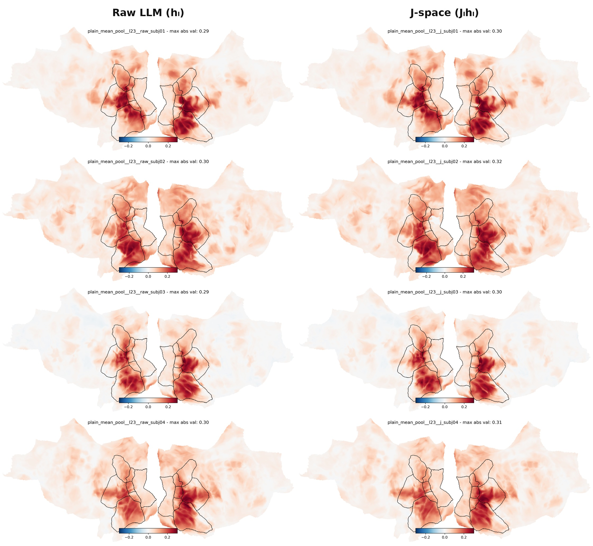
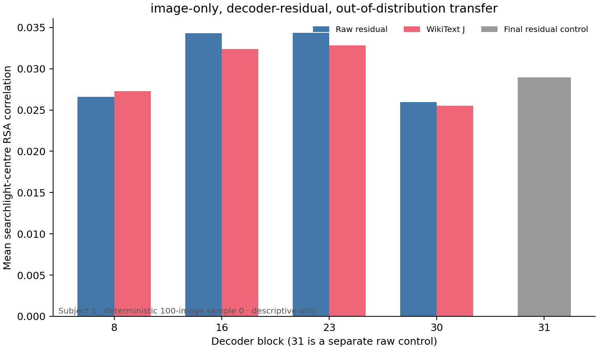

# Jacobian Lens × NSD

## Abstract

This project tests whether Jacobian-transported residual representations from
Qwen3.5-4B align with human brain responses to natural scenes differently from
matched raw residual representations. Caption-derived text—not images—is passed
through the language model, and representational similarity analysis (RSA)
compares the resulting features with Natural Scenes Dataset (NSD) fMRI
responses. Each prompt is read out as the **mean over all valid non-padding
tokens**, so a representation summarises the whole caption rather than one
position. The comparison holds model, prompt, layer, readout, stimuli, and
brain-analysis pipeline fixed.

## Research question

**Do Jacobian-transported (J-space) representations exhibit a different
spatial distribution or magnitude of brain alignment than raw LLM residual
representations?** Here, *different* denotes a change relative to the matched
raw control; it does not imply that J-space is *better*. A claim of better
alignment requires a defined comparison metric and subject-level inference,
not visual inspection alone.



*Figure 1. Raw versus J-space brain alignment at Qwen3.5-4B layer 23. For
concision the montage shows subjects 1–4: each row is one subject, with raw
`plain_mean_pool__l23__raw` on the left and its matched
`plain_mean_pool__l23__j` on the right. All numerical and statistical analyses
and tables use all eight subjects (1–8). Each cortical map is the subject-level
mean over eight matched 100-stimulus samples, projected to `fsaverage`, with
stream-ROI contours overlaid. Color encodes searchlight RSA correlation (Pearson
r between the brain and model correlation-distance RDMs). Panels use independent
symmetric color limits, reported by the maximum absolute value in each title.
The montage composes completed maps without recomputing RSA or surface
projection. These maps are descriptive and do not by themselves test whether
either representation is better.*

## Methodology

- **Model and features.** The primary model is
  [`Qwen/Qwen3.5-4B`](https://huggingface.co/Qwen/Qwen3.5-4B). Layers 8, 16, 23,
  and 30 contribute the raw residual \(h_l\) and its transported representation
  \(J_l h_l\); the final decoder-block residual is an additional control. The
  fixed pretrained `qwen-n1000` lens contains layer-to-final average Jacobians
  estimated from 1,000 WikiText examples, following the
  [Jacobian Lens](https://transformer-circuits.pub/2026/workspace/index.html)
  formulation (Gurnee et al., 2026).
- **Text inputs.** Each NSD stimulus is represented by its COCO captions,
  supplied to the model directly. The pipeline is deterministic and uses no
  image pixels, chat template, text generation, or truncation.
- **Readout.** Features are **all-token mean-pooled causal decoder residuals**.
  For each prompt, exactly the positions where the attention mask is 1 are
  included and padding positions are excluded; any tokenizer-added special token
  is included if and only if it is present in that encoding. Decoder causal
  masking means position *t* sees its prefix through *t*, so this is not
  bidirectional whole-caption contextualization. J is applied to every valid
  token *before* pooling; because `J_l` is linear, each extraction batch also
  computes J after pooling and requires agreement within
  `1e-5 + 1e-5 × max_abs`, recording the worst per-layer error in the manifest.
  A generated `token_mask_audit.json` records every condition's input token IDs,
  attention mask, valid positions, and included special tokens.

  Pooling is not a cosmetic choice. **73.7% of the 6,148 caption prompts end in
  the same token — a period** — so a single-endpoint readout reads an identical
  token for most of the dataset. Scored against MPNet sentence embeddings of the
  same captions, an endpoint readout's RDM correlates 0.017-0.067, while the
  pooled readout reaches 0.41-0.58, and the two readouts correlate only
  0.04-0.15 with each other. That 8-23x semantic gap is measured with no access
  to fMRI data and brackets the brain-side gap, so the readout is justified
  independently of the result it produces. See
  [`analyze_readout_semantics.py`](scripts/analyze_readout_semantics.py).
- **Representational comparison.** For every subject and feature, pairwise
  correlation-distance RDMs are computed without feature normalization.
  Matched NSD searchlights compare these model RDMs with local fMRI-pattern
  RDMs using Pearson correlation. Analyses use subjects 1–8, sessions 1–10,
  three-repeat conditions, and the same eight disjoint 100-stimulus samples per
  subject. MPNet is retained as a semantic reference; the primary comparison is
  always \(J_l h_l\) versus \(h_l\) from the same Qwen layer, prompt, readout,
  stimuli, and searchlight pipeline.

The overall LLM–NSD alignment paradigm follows
[Doerig et al. (2025)](https://doi.org/10.1038/s42256-025-01072-0), and the RDM
comparison follows the original RSA framework of
[Kriegeskorte, Mur, and Bandettini (2008)](https://doi.org/10.3389/neuro.06.004.2008).
The repeated-image dataset and caption provenance are described by
[Allen et al. (2022)](https://doi.org/10.1038/s41593-021-00962-x) and
[Lin et al. (2014)](https://doi.org/10.1007/978-3-319-10602-1_48), respectively.
See [DESIGN.md](docs/DESIGN.md) for the full protocol and interpretation
guardrails.

## Layer performance summary

Group means of subject whole-searchlight summaries over all eight subjects.
Subjects are the independent unit. Significance is a two-sided exact sign-flip
test enumerating all `2^8` sign assignments of the paired subject differences,
Benjamini–Hochberg corrected within the four-test `plain_mean_pool_j_vs_raw_4`
family alone.

| Layer | Raw mean | J mean | J−raw | 95% CI on J−raw | BH q |
|---|---:|---:|---:|---:|---:|
| 8 | 0.025914 | 0.025438 | -0.000476 | [-0.002614, +0.001662] | 0.64062 |
| 16 | 0.029382 | 0.029738 | +0.000356 | [-0.001442, +0.002155] | 0.64062 |
| 23 | 0.029810 | 0.031460 | +0.001649 | [+0.000617, +0.002682] | **0.04688** |
| 30 | 0.028265 | 0.029724 | +0.001459 | [+0.000514, +0.002405] | **0.04688** |
| Final-block control | — | 0.029597 | — | — | — |
| MPNet reference | — | 0.026736 | — | — | — |

The J-space advantage is **depth-dependent**: absent at layers 8 and 16, present
at layers 23 and 30. It is also small — roughly `+0.0016` against a base near
`0.03`, about a 5% relative gain — and both surviving q-values sit just under
0.05. Treat it as a real but modest late-layer effect, not a headline. Layer 23
carries both the strongest single feature (`plain_mean_pool__l23__j`) and the
largest J−raw contrast.

### What the layer profile cannot yet establish

The depth pattern is the natural thing to read as evidence about *where* the
workspace lives. It cannot currently support that reading, for two measured
reasons.

**The lens is ill-conditioned exactly where the effect is absent.** `J_l` is an
*average* Jacobian, so the further a source layer sits from the final layer, the
more nonlinear blocks are averaged through and the more its rank collapses. At
layer 8 the map uses roughly 400 of 2,560 directions with a condition number near
`2e6`; at layer 30 it is close to a mild, well-conditioned reweighting. "Early
layer" is therefore confounded with "barely usable lens".

**The early-layer nulls are partly a precision problem.** Across-subject variance
of the J−raw difference tracks the lens's condition number monotonically over
these four layers, so the early layers carry roughly double the per-subject noise
and a ~7x worse effect-to-noise ratio. A null there is as consistent with "cannot
measure it" as with "nothing to measure".

A separate result cuts against the mechanistic reading directly: the J-space
advantage appears where the lens changes representational geometry *least*. The
warp is real and demonstrably data-aligned — the released lens alters the RDM far
more than a random matrix with the identical singular spectrum — but its
magnitude *anti*-correlates with brain benefit across layers.

Generators and full numbers: [`analyze_lens_geometry.py`](scripts/analyze_lens_geometry.py),
[`analyze_lens_controls.py`](scripts/analyze_lens_controls.py), and
[`analyze_subject_consistency.py`](scripts/analyze_subject_consistency.py).

See [WHOLE_PROMPT_POOLING.md](docs/WHOLE_PROMPT_POOLING.md) for the exact
estimand, the mask contract, and the predeclared inference families.

## Image-only WikiText transfer pilot

The isolated pilot is an **image-only, decoder-residual, out-of-distribution
transfer** of the released WikiText lens. It is not a vision-tower Jacobian
Lens: pixels pass through Qwen's vision stack, and the released matrices act
only on projected 2,560-dimensional decoder residuals. No caption, generated
description, semantic instruction, chat template, or image–caption fusion is
present. See the [audited pilot report](docs/IMAGE_ONLY_WIKITEXT_PILOT.md).


*Figure 2. Whole-searchlight mean RSA correlations for subject 1 and one
deterministic 100-image sample. Raw and J scores remain paired and separate at
layers 8, 16, 23, and 30; block 31 is a separate final-residual raw control.
These values are descriptive and do not support population inference.*

## Installation

Lightweight development and model-free tests do not install model weights,
Torch, TensorFlow, or NSD tooling:

```bash
python -m venv .venv
. .venv/bin/activate
python -m pip install -e '.[dev]'
jlens-nsd --help
jlens-nsd smoke
```

Install model extraction support separately:

```bash
python -m pip install -e '.[model]'
```

The `nsd-upstream` extra pins NSD source commit
`a60e0eafb8d02841159e344adb732062734bc302`. Its
[historical KietzmannLab repository](https://github.com/KietzmannLab/nsd_visuo_semantics)
is unavailable; the same public history is currently hosted at
[`adriendoerig/visuo_llm`](https://github.com/adriendoerig/visuo_llm). Because
the upstream metadata pins TensorFlow 2.15 and a large legacy dependency set,
use the extra on a compatible Python 3.10/3.11 environment:

```bash
python -m pip install -e '.[nsd-upstream]'
```

In a modern pre-provisioned scientific environment, including Python 3.12,
install the source without its dependency set and add this project's runtime
extra:

```bash
python -m pip install --no-deps \
  'nsd-visuo-semantics @ git+https://github.com/adriendoerig/visuo_llm.git@a60e0eafb8d02841159e344adb732062734bc302'
python -m pip install -e '.[nsd-runtime]'
```

The `model` extra pins Anthropic's `jacobian-lens` source. A local checkout can
instead be selected with `--jlens-checkout` or
`JLENS_NSD_JLENS_CHECKOUT`.

## Configuration and running

External paths are supplied by global CLI flags or matching environment
variables; no workstation path is built into the package.

| CLI flag | Environment variable | Purpose |
|---|---|---|
| `--results-dir` | `JLENS_NSD_RESULTS` | New or resumed artifacts; default `./results` |
| `--nsd-dir` | `JLENS_NSD_NSD_DIR` | NSD root |
| `--captions` | `JLENS_NSD_CAPTIONS` | 73,000-row tokenized caption pickle |
| `--mpnet-base` | `JLENS_NSD_MPNET_BASE` | Existing 10-session MPNet result tree |
| `--jlens-checkout` | `JLENS_NSD_JLENS_CHECKOUT` | Optional Jacobian Lens source checkout |

Local model and lens directories can be set with
`JLENS_NSD_QWEN4B_MODEL`, `JLENS_NSD_QWEN1_7B_MODEL`, and
`JLENS_NSD_LENS_ROOT`. The extraction stages also accept `--model-path` and
`--lens-root`; the orchestrator accepts `--qwen4b-model`,
`--qwen1-7b-model`, and `--lens-root`.

Global flags precede an individual stage:

```bash
jlens-nsd \
  --results-dir /path/to/jlens-results \
  --nsd-dir /path/to/NSD \
  --captions /path/to/nsd_allWords_per_image.pkl \
  --mpnet-base /path/to/mpnet_10_sessions \
  prepare

jlens-nsd --results-dir /path/to/jlens-results smoke --with-data
```

The resumable end-to-end run uses the canonical 4B profile and a matched 1.7B
fallback:

```bash
jlens-nsd-orchestrate \
  --results-dir /path/to/jlens-results \
  --nsd-dir /path/to/NSD \
  --captions /path/to/nsd_allWords_per_image.pkl \
  --mpnet-base /path/to/mpnet_10_sessions \
  --profile qwen4b --fallback-profile qwen1.7b \
  --readout-mode all_token_mean \
  --subjects 1,2,3,4,5,6,7,8
```

For subset validation, `--subjects 1` scopes condition preparation, RDMs,
searchlight, projection, plots, and the descriptive report to subject 1. The
available stages are `prepare`, `prefetch`, `preflight`, `extract`, `rdms`,
`searchlight`, `project`, `plot`, and `summarize`. See the
[runbook](docs/RUNBOOK.md) for stage-specific commands and resume behavior and
the [upstream compatibility note](docs/UPSTREAM_COMPATIBILITY.md) for the
precise dependency boundary.

Generated results, external datasets, and model weights remain outside Git and
are excluded by `.gitignore`; only compact documentation assets such as Figure
1 belong in the repository. Model-free unit, lint, package, CLI, and synthetic
smoke checks run without external data. Real extraction and searchlight checks
require the configured weights, GPU, NSD data, searchlight geometry, and
`pycortex`/`fsaverage` assets.

See [ATTRIBUTION.md](ATTRIBUTION.md) and [LICENSE](LICENSE).
