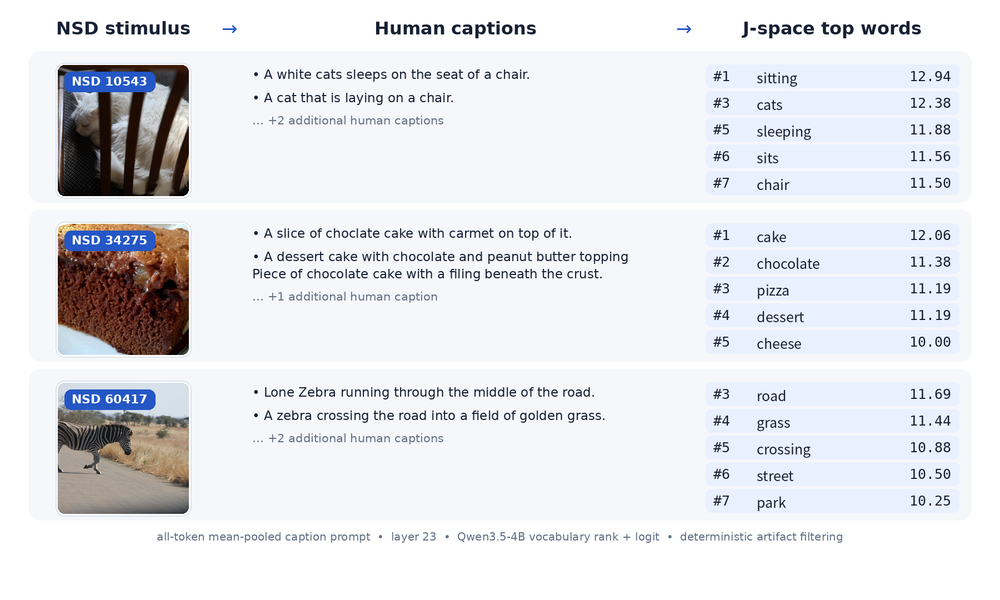

# Jacobian Lens × NSD

## Human note
Hello fellow human 👋! Since this project is largely LLM written, and you are likely interfacing with it through an LLM of your own, I am adding this section as a space for us biological entities to share. Depending on who you are, you may discard this mass of nicely structured tokens as slop, or you may take it seriously. To help with that judgment, here is an honest disclosure of the relationship between biological and artificial cognition which contributed to this project. The entire paradigm and most of code is built on an existing paper created and implemented by a human - whom I have met in reality - within the context of a larger research program historically carried out by humans. The new conceptual angle - the j space - is based on research most likely carried out by a combination of humans and LLMs, but at least by the most qualified humans. My addition - the idea - is a novel but naive synthesis of the two to create an incremental extension in the broader paradigm of uncovering statistical dependencies, or shared information, between LLMs and biological brains. The following README is LLM generated, but closely following the higher level structure outlined by me, the human, over the course of several streams of iteration and refinement. The novel code is LLM generated under the guidance of me, the human, who spent several weeks grappling with the underlying concepts and instantiating them on my personal workstation. My recommendation would be to read this section, as you have, and perhaps the following README, and to leave the rest to your extended cognitive companions. As we increasingly become more entwined with these bots, I hope you come to see, as I increasingly am, that traditional research papers are entering the domain of weekend projects. With some lucky, this will mean that we can all traverse the search space of scientific knowledge with a more exciting pace. Thank you for reading - I wish you a peaceful, exciting, and joyous journey into our increasingly multidimensional world ❤️!

## Abstract

This project tests whether Jacobian-transported residual representations from
Qwen3.5-4B align with human brain responses to natural scenes differently from
matched raw residual representations. Caption-derived text—not images—is passed
through the language model, and representational similarity analysis (RSA)
compares the resulting features with Natural Scenes Dataset (NSD) fMRI
responses. Each prompt is read out as the **mean over all valid non-padding
tokens**, so a representation summarises the whole caption rather than one
position. The comparison holds model, prompt, layer, readout, stimuli, and
brain-analysis pipeline fixed.

## Research question

**Do Jacobian-transported (J-space) representations exhibit a different
spatial distribution or magnitude of brain alignment than raw LLM residual
representations?** Here, *different* denotes a change relative to the matched
raw control; it does not imply that J-space is *better*. A claim of better
alignment requires a defined comparison metric and subject-level inference,
not visual inspection alone.


*Figure 1. Raw versus J-space brain alignment at Qwen3.5-4B layer 23. For
concision the montage shows subjects 1–4: each row is one subject, with raw
`plain_mean_pool__l23__raw` on the left and its matched
`plain_mean_pool__l23__j` on the right. All numerical and statistical analyses
and tables use all eight subjects (1–8). Each cortical map is the subject-level
mean over eight matched 100-stimulus samples, projected to `fsaverage`, with
stream-ROI contours overlaid. Color encodes searchlight RSA correlation (Pearson
r between the brain and model correlation-distance RDMs). Panels use independent
symmetric color limits, reported by the maximum absolute value in each title.
The montage composes completed maps without recomputing RSA or surface
projection. These maps are descriptive and do not by themselves test whether
either representation is better.*

## Methodology

- **Model and features.** The primary model is
  [`Qwen/Qwen3.5-4B`](https://huggingface.co/Qwen/Qwen3.5-4B). Layers 8, 16, 23,
  and 30 contribute the raw residual \(h_l\) and its transported representation
  \(J_l h_l\); the final decoder-block residual is an additional control. The
  fixed pretrained `qwen-n1000` lens contains layer-to-final average Jacobians
  estimated from 1,000 WikiText examples, following the
  [Jacobian Lens](https://transformer-circuits.pub/2026/workspace/index.html)
  formulation (Gurnee et al., 2026).
- **Text inputs.** Each NSD stimulus is represented by its COCO captions,
  supplied to the model directly. The pipeline is deterministic and uses no
  image pixels, chat template, text generation, or truncation.
- **Readout.** Features are **all-token mean-pooled causal decoder residuals**.
  For each prompt, exactly the positions where the attention mask is 1 are
  included and padding positions are excluded; any tokenizer-added special token
  is included if and only if it is present in that encoding. Decoder causal
  masking means position *t* sees its prefix through *t*, so this is not
  bidirectional whole-caption contextualization. J is applied to every valid
  token *before* pooling; because `J_l` is linear, each extraction batch also
  computes J after pooling and requires agreement within
  `1e-5 + 1e-5 × max_abs`, recording the worst per-layer error in the manifest.
  A generated `token_mask_audit.json` records every condition's input token IDs,
  attention mask, valid positions, and included special tokens.
- **Representational comparison.** For every subject and feature, pairwise
  correlation-distance RDMs are computed without feature normalization.
  Matched NSD searchlights compare these model RDMs with local fMRI-pattern
  RDMs using Pearson correlation. Analyses use subjects 1–8, sessions 1–10,
  three-repeat conditions, and the same eight disjoint 100-stimulus samples per
  subject. MPNet is retained as a semantic reference; the primary comparison is
  always \(J_l h_l\) versus \(h_l\) from the same Qwen layer, prompt, readout,
  stimuli, and searchlight pipeline.

The overall LLM–NSD alignment paradigm follows
[Doerig et al. (2025)](https://doi.org/10.1038/s42256-025-01072-0), and the RDM
comparison follows the original RSA framework of
[Kriegeskorte, Mur, and Bandettini (2008)](https://doi.org/10.3389/neuro.06.004.2008).
The repeated-image dataset and caption provenance are described by
[Allen et al. (2022)](https://doi.org/10.1038/s41593-021-00962-x) and
[Lin et al. (2014)](https://doi.org/10.1007/978-3-319-10602-1_48), respectively.
See [DESIGN.md](docs/DESIGN.md) for the full protocol and interpretation
guardrails.

## Layer performance summary

Group means of subject whole-searchlight summaries over all eight subjects.
Subjects are the independent unit. Significance is a two-sided exact sign-flip
test enumerating all `2^8` sign assignments of the paired subject differences,
Benjamini–Hochberg corrected within the four-test `plain_mean_pool_j_vs_raw_4`
family alone.

| Layer | Raw mean | J mean | J−raw | 95% CI on J−raw | BH q |
|---|---:|---:|---:|---:|---:|
| 8 | 0.025914 | 0.025438 | -0.000476 | [-0.002614, +0.001662] | 0.64062 |
| 16 | 0.029382 | 0.029738 | +0.000356 | [-0.001442, +0.002155] | 0.64062 |
| 23 | 0.029810 | 0.031460 | +0.001649 | [+0.000617, +0.002682] | **0.04688** |
| 30 | 0.028265 | 0.029724 | +0.001459 | [+0.000514, +0.002405] | **0.04688** |
| Final-block control | — | 0.029597 | — | — | — |
| MPNet reference | — | 0.026736 | — | — | — |

The J-space advantage is **depth-dependent**: absent at layers 8 and 16, present
at layers 23 and 30. It is also small — roughly `+0.0016` against a base near
`0.03`, about a 5% relative gain — and both surviving q-values sit just under
0.05. Treat it as a real but modest late-layer effect, not a headline. Layer 23
carries both the strongest single feature (`plain_mean_pool__l23__j`) and the
largest J−raw contrast.

### What J-space reads out, in words



*Figure 2. Vocabulary readouts from `unembed(J_23 h_23)` for three subject-1
conditions, using the documented pooled caption readout. Each row pairs one NSD
stimulus with its human captions and the five highest-scoring vocabulary tokens
of its transported representation, with raw ranks and logits retained after a
deterministic formatting-only and duplicate-token filter; no semantic term was
selected or removed. Rows are chosen without looking at their content: the
subject-1 set is restricted to images whose COCO metadata carries CC BY 2.0,
then indices floor(n/6), floor(n/2) and floor(5n/6) sample three equal spans of
the sorted eligible set. Stimulus sources (NSD crop / COCO ID) are
10,543 / 23,163: [“Chair as Frame” by zeevveez](https://www.flickr.com/photos/zeevveez/7990954613/),
34,275 / 104,825: [“Coca-Cola cake” by TheSeafarer](https://www.flickr.com/photos/sheilascarborough/9270434659/),
and 60,417 / 207,117: [“zebra crossing!” by krugergirl26](https://www.flickr.com/photos/71888644@N00/6114561350/);
all three are licensed [CC BY 2.0](https://creativecommons.org/licenses/by/2.0/).*

The readouts are recognisably about the scene — `sitting / cats / sleeping /
sits / chair` for the first row, `cake / chocolate / pizza / dessert / cheese`
for the second, `road / grass / crossing / street / park` for the third. That is
what the transported representation is disposed to make the model *say* about
each stimulus.

It is also a useful reminder of what the caption pipeline is doing. These words
are close paraphrases of the captions the model was given, which is exactly the
concern raised under [Interpretation](#interpretation-what-this-design-can-and-cannot-ask):
the semantic content visible here entered through a human description of the
image rather than through the image itself.

Vocabulary unembedding is an **interpretive diagnostic only**, analogous to the
readout role discussed by the [Tuned Lens](https://arxiv.org/abs/2303.08112).
The brain RDMs do not use these tokens or logits — they use the full
2,560-dimensional vectors. Top words that look like scene content and
representational geometry are different measurements. The audited generator is
[`make_jspace_readout_figure.py`](scripts/make_jspace_readout_figure.py); the
figure embeds its selection rule, per-row vector hashes, and the unembedding
adapter in PNG metadata.

## Interpretation: what this design can and cannot ask

Two limitations of this design are **structural** rather than statistical.
Neither is fixed by more subjects, better correction, or a different readout, and
both bear on how any positive result here should be read.

### The captions already contain the semantics the model is being asked to supply

The stimulus reaching the brain is an **image**. The input reaching the model is a
**human-written caption of that image**. A person has therefore already performed
the perceptual-to-semantic extraction that the model is nominally being tested
on, and the model receives its output rather than the stimulus.

What the comparison measures, then, is largely how well *caption semantics*
predict visual cortex — a relationship established well before this project. The
model's marginal contribution over a generic sentence embedding of the same text
is correspondingly small:

| feature | mean RSA r | vs MPNet |
|---|---:|---:|
| `mpnet_reference` (sentence embedding) | 0.026736 | — |
| `plain_mean_pool__l23__j` (best) | 0.031460 | +17.7% |
| `plain_mean_pool__l23__raw` | 0.029810 | +11.5% |
| `plain_mean_pool__l08__j` | 0.025438 | **−4.9%** |

A 4B-parameter language model with a fitted Jacobian lens beats an off-the-shelf
sentence encoder by 18% at its best layer, and is *worse* than it at layer 8.
That is the expected profile if the caption text — not the model, and not the
lens — is carrying most of the signal. Any claim about J-space here has to clear
the caption baseline first, and the margin available for clearing it is narrow.

A design that avoided this would put the model on the same input the brain
received, or would use text that is not itself a semantic summary of the
stimulus.

### Visual encoding may be the wrong paradigm for a workspace construct

J-space is defined as what an activation is *disposed to make the model say* —
verbalizable, broadcast-ready content. That is an analogue of higher-level,
report-linked cognition: deliberation, integration, the contents available for
explicit report. It is not a claim about sensory transduction.

NSD measures **passive viewing of natural images**. The dependent variable is
stimulus-driven visual response. Testing a construct about verbalizable content
against a paradigm with no report, no task demand, and no deliberative component
is plausibly a category mismatch — the experiment may simply not contain the
phenomenon the lens is built to isolate.

The spatial results are consistent with that reading. The J advantage does not
concentrate in any cortical system: normalised for regional signal level, it is a
near-uniform proportional gain of roughly 8% everywhere, with 94 of 180 HCP-MMP1
parcels individually significant. If J-space corresponded to a specific
higher-order network one would expect concentration; a flat, global gain looks
more like a property of the representation as a whole than the signature of a
workspace.

Paradigms with an explicit report, task-driven attention, or language
comprehension as the stimulus would put the construct and the measurement on the
same footing. Naturalistic-listening datasets are one obvious option, and the
`streams`/HCP-MMP1 localisation machinery here transfers unchanged.

Generators for the figures quoted above:
[`analyze_cortex_localisation.py`](scripts/analyze_cortex_localisation.py) for the
normalised whole-cortex localisation,
[`analyze_lens_geometry.py`](scripts/analyze_lens_geometry.py) and
[`analyze_lens_controls.py`](scripts/analyze_lens_controls.py) for the lens's
conditioning and direction controls, and
[`analyze_subject_consistency.py`](scripts/analyze_subject_consistency.py) for
per-subject robustness. The `wiki/` directory records the full set of checks and
what each one settled.

## Image-only WikiText transfer pilot

The isolated pilot is an **image-only, decoder-residual, out-of-distribution
transfer** of the released WikiText lens. It is not a vision-tower Jacobian
Lens: pixels pass through Qwen's vision stack, and the released matrices act
only on projected 2,560-dimensional decoder residuals. No caption, generated
description, semantic instruction, chat template, or image–caption fusion is
present. See the [audited pilot report](docs/IMAGE_ONLY_WIKITEXT_PILOT.md).


*Figure 3. Whole-searchlight mean RSA correlations for subject 1 and one
deterministic 100-image sample. Raw and J scores remain paired and separate at
layers 8, 16, 23, and 30; block 31 is a separate final-residual raw control.
These values are descriptive and do not support population inference.*

## Installation

Lightweight development and model-free tests do not install model weights,
Torch, TensorFlow, or NSD tooling:

```bash
python -m venv .venv
. .venv/bin/activate
python -m pip install -e '.[dev]'
jlens-nsd --help
jlens-nsd smoke
```

Install model extraction support separately:

```bash
python -m pip install -e '.[model]'
```

The `nsd-upstream` extra pins NSD source commit
`a60e0eafb8d02841159e344adb732062734bc302`. Its
[historical KietzmannLab repository](https://github.com/KietzmannLab/nsd_visuo_semantics)
is unavailable; the same public history is currently hosted at
[`adriendoerig/visuo_llm`](https://github.com/adriendoerig/visuo_llm). Because
the upstream metadata pins TensorFlow 2.15 and a large legacy dependency set,
use the extra on a compatible Python 3.10/3.11 environment:

```bash
python -m pip install -e '.[nsd-upstream]'
```

In a modern pre-provisioned scientific environment, including Python 3.12,
install the source without its dependency set and add this project's runtime
extra:

```bash
python -m pip install --no-deps \
  'nsd-visuo-semantics @ git+https://github.com/adriendoerig/visuo_llm.git@a60e0eafb8d02841159e344adb732062734bc302'
python -m pip install -e '.[nsd-runtime]'
```

The `model` extra pins Anthropic's `jacobian-lens` source. A local checkout can
instead be selected with `--jlens-checkout` or
`JLENS_NSD_JLENS_CHECKOUT`.

## Configuration and running

External paths are supplied by global CLI flags or matching environment
variables; no workstation path is built into the package.

| CLI flag | Environment variable | Purpose |
|---|---|---|
| `--results-dir` | `JLENS_NSD_RESULTS` | New or resumed artifacts; default `./results` |
| `--nsd-dir` | `JLENS_NSD_NSD_DIR` | NSD root |
| `--captions` | `JLENS_NSD_CAPTIONS` | 73,000-row tokenized caption pickle |
| `--mpnet-base` | `JLENS_NSD_MPNET_BASE` | Existing 10-session MPNet result tree |
| `--jlens-checkout` | `JLENS_NSD_JLENS_CHECKOUT` | Optional Jacobian Lens source checkout |

Local model and lens directories can be set with
`JLENS_NSD_QWEN4B_MODEL`, `JLENS_NSD_QWEN1_7B_MODEL`, and
`JLENS_NSD_LENS_ROOT`. The extraction stages also accept `--model-path` and
`--lens-root`; the orchestrator accepts `--qwen4b-model`,
`--qwen1-7b-model`, and `--lens-root`.

Global flags precede an individual stage:

```bash
jlens-nsd \
  --results-dir /path/to/jlens-results \
  --nsd-dir /path/to/NSD \
  --captions /path/to/nsd_allWords_per_image.pkl \
  --mpnet-base /path/to/mpnet_10_sessions \
  prepare

jlens-nsd --results-dir /path/to/jlens-results smoke --with-data
```

The resumable end-to-end run uses the canonical 4B profile and a matched 1.7B
fallback:

```bash
jlens-nsd-orchestrate \
  --results-dir /path/to/jlens-results \
  --nsd-dir /path/to/NSD \
  --captions /path/to/nsd_allWords_per_image.pkl \
  --mpnet-base /path/to/mpnet_10_sessions \
  --profile qwen4b --fallback-profile qwen1.7b \
  --readout-mode all_token_mean \
  --subjects 1,2,3,4,5,6,7,8
```

For subset validation, `--subjects 1` scopes condition preparation, RDMs,
searchlight, projection, plots, and the descriptive report to subject 1. The
available stages are `prepare`, `prefetch`, `preflight`, `extract`, `rdms`,
`searchlight`, `project`, `plot`, and `summarize`. See the
[runbook](docs/RUNBOOK.md) for stage-specific commands and resume behavior and
the [upstream compatibility note](docs/UPSTREAM_COMPATIBILITY.md) for the
precise dependency boundary.

Generated results, external datasets, and model weights remain outside Git and
are excluded by `.gitignore`; only compact documentation assets such as Figure
1 belong in the repository. Model-free unit, lint, package, CLI, and synthetic
smoke checks run without external data. Real extraction and searchlight checks
require the configured weights, GPU, NSD data, searchlight geometry, and
`pycortex`/`fsaverage` assets.

See [ATTRIBUTION.md](ATTRIBUTION.md) and [LICENSE](LICENSE).
