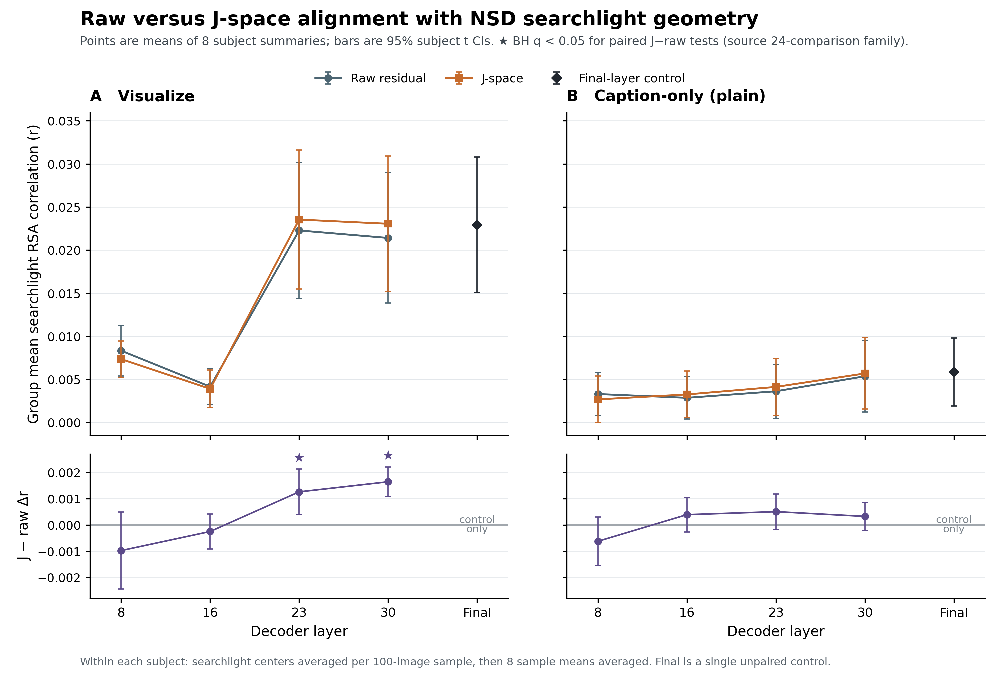

# Raw versus J-space performance across decoder layers

The completed eight-subject run shows a prompt-dependent pattern. Under the
`visualize` prompt, J-space exceeds the matched raw residual at layers 23
(Δr = +0.001261, exact p = 0.0078125, BH q = 0.01875) and 30
(Δr = +0.001645, exact p = 0.0078125, BH q = 0.01875). Neither earlier
`visualize` layer nor any caption-only (`plain`) layer is significant after the
source report's multiplicity correction. This is an exploratory whole-searchlight
summary, not a held-out model-selection result.



## What the metric means

At every searchlight center, the pipeline correlates the local brain RDM with a
model RDM. Model RDMs use correlation distance; the RDM-to-RDM score is a
Pearson correlation. A sample score is the mean across valid searchlight-center
correlations. The report then averages eight matched 100-image sample scores
within each subject and finally averages the eight subject summaries. Thus
`mean_correlation` is a group mean of subject-level summaries—not a pooled
sample, voxel, or searchlight-level mean. This follows the searchlight RSA logic
introduced by [Kriegeskorte, Mur, and Bandettini
(2008)](https://doi.org/10.3389/neuro.06.004.2008).

Error bars are two-sided 95% Student t intervals over the eight subject scores
(df = 7). J−raw is calculated within subject after center/sample aggregation,
then averaged across subjects. The exact paired p-value exhaustively evaluates
all 2^8 sign assignments of those subject deltas using the absolute mean; its
smallest possible value is 2/256 = 0.0078125. Sign-flip/randomization inference
is a standard neuroimaging approach when the exchangeability assumptions match
the design; see [Nichols and Holmes
(2002)](https://doi.org/10.1002/hbm.1058).

The displayed q-values are the authoritative source values: Benjamini–Hochberg
adjustment over all 24 comparisons generated by the upstream report (eight J
features, each compared with matched raw, same-prompt final, and MPNet). The
flag uses q < 0.05. BH controls false discovery rate for its specified family,
not family-wise error; see [Benjamini and Hochberg
(1995)](https://doi.org/10.1111/j.2517-6161.1995.tb02031.x).

## Final-layer control and result pattern

`Final` is the prompt-specific final-block residual. It is plotted once per
prompt as a control and has its own subject-level CI. It is not labeled raw or
J-space, and no J−raw delta or paired test is invented for it. The `visualize`
final control is r = 0.022931 [0.015043, 0.030819]; the caption-only final
control is r = 0.005865 [0.001926, 0.009804].

The strongest absolute decoder result is `visualize` J-space at layer 23
(r = 0.023541), closely followed by `visualize` J-space at layer 30
(r = 0.023056). J-space is lower than raw at `visualize` layers 8 and 16, then
higher at layers 23 and 30. Caption-only deltas are small and mixed, ranging
from −0.000622 (layer 8) to +0.000506 (layer 23), with no BH-significant paired
comparison. With only eight independent subjects and exploratory aggregation
over the full searchlight field, the figure supports a localized descriptive
late-layer effect under `visualize`, not a general claim that J-space always
improves brain alignment.

## Auditable artifacts

- [Compact CSV table](layer_performance_summary.csv)
- [Generation metadata and SHA-256 hashes](layer_performance_summary.metadata.json)
- Generator: `scripts/make_layer_performance_summary.py`

Regenerate from the completed report directory:

```bash
python scripts/make_layer_performance_summary.py \
  --report-dir /path/to/results/reports/qwen4b
```

The generator requires exactly 19 expected feature IDs, eight subjects, eight
samples per subject, and the complete 24-comparison family. It verifies exact
CSV/JSON equality, exact sample-to-subject averaging, and numerical reproduction
of all means, CIs, deltas, p-values, and q-values from the NPY arrays before
writing any output. It never reads or recomputes searchlights.
