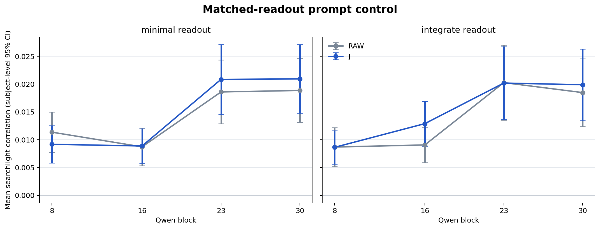
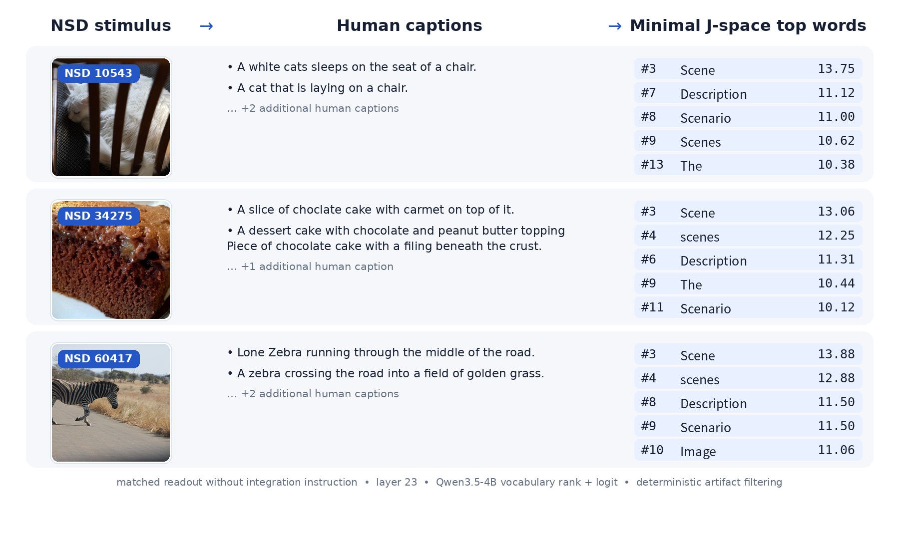

# Matched-readout control: completed results

## Completion and endpoint evidence

The canonical Qwen3.5-4B run completed for all eight subjects on 2026-08-15.
It used 6,148 union conditions (835 per subject), 97 atomic extraction chunks,
layers 8/16/23/30, 64 locked searchlight samples, 304 required projected
hemisphere surfaces, and 152 per-subject plots. All 15 orchestrated stages and
all manifest/shape/finiteness checks passed.

For all 6,148 conditions, Qwen's tokenizer encoded the fixed suffix
`\n\nScene representation:` as `[271, 9723, 12669, 25]`. The final readout
token was ID 25 for both prompts in every pair. The suffix is 23 UTF-8 bytes
(`0a0a5363656e6520726570726573656e746174696f6e3a`), the endpoint-ID hash is
`1683fa6caf344b0e5ad23518b44fb5e1d30df461a6c3f2479f937890d13deb5d`,
and the paired suffix-token hash is
`60233adc2eae5a0b8a41bc3fd10d7604551e2a8b58e5c786d7982747475f17db`.
The longest prompt was 181 tokens, below the 256-token no-truncation guard.
The compact machine-readable record is
[`matched_readout_endpoint_audit.json`](matched_readout_endpoint_audit.json).

## Population results

Scores are correlations averaged across valid searchlight centres within each
sample, then across eight samples within each subject. Means, two-sided 95%
subject t intervals, and exact two-sided sign-flip tests use the eight subjects
as independent units. BH adjustment is separate for the predeclared 8-test
J-vs-raw family and 9-test integrate-vs-minimal family.

Five J-vs-raw contrasts survived BH at q < .05:

| Prompt | Layer | Raw mean | J mean | J − raw [95% CI] | Exact p | BH q |
|---|---:|---:|---:|---:|---:|---:|
| integrate | 16 | 0.009058 | 0.012890 | 0.003832 [0.002301, 0.005364] | 0.007812 | 0.015625 |
| integrate | 30 | 0.018473 | 0.019883 | 0.001410 [0.000737, 0.002082] | 0.007812 | 0.015625 |
| minimal | 8 | 0.011352 | 0.009171 | -0.002182 [-0.003466, -0.000897] | 0.023438 | 0.037500 |
| minimal | 23 | 0.018590 | 0.020846 | 0.002256 [0.001596, 0.002916] | 0.007812 | 0.015625 |
| minimal | 30 | 0.018855 | 0.020936 | 0.002081 [0.001378, 0.002784] | 0.007812 | 0.015625 |

No integrate-vs-minimal contrast survived its separate 9-test BH family. The
smallest unadjusted prompt-pair p-value was for layer-16 J-space
(delta = 0.004022, 95% CI [0.000463, 0.007581], p = 0.046875,
q = 0.421875). This is not evidence of equivalence or absence of an instruction
effect; it means this experiment did not reject any prompt-pair null after its
predeclared family correction. These whole-searchlight summaries remain
exploratory rather than held-out model selection.

Every exact group mean, confidence interval, delta, p, q, feature ID, baseline,
and family is in [`matched_readout_performance.csv`](matched_readout_performance.csv).

## Layer-23 vocabulary readouts

The two figures use the same deterministic CC BY 2.0 conditions (NSD 10,543,
34,275, and 60,417), full-run vectors, and unchanged formatting-only filter.
Raw rank, token ID, logit, vector hash, counterpart hash, and source chunk are
embedded in each PNG. The displayed tokens are interpretive only; brain RSA
uses the full 2,560-dimensional vectors.

The inferential design follows representational similarity analysis
([Kriegeskorte, Mur, and Bandettini, 2008](https://doi.org/10.3389/neuro.06.004.2008))
and separately declared false-discovery families
([Benjamini and Hochberg, 1995](https://doi.org/10.1111/j.2517-6161.1995.tb02031.x)).
See [`MATCHED_READOUT_CONTROL.md`](MATCHED_READOUT_CONTROL.md) for the design
rationale and fixed contract.
